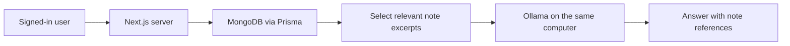

<div align="center">

# SmartNotes
### A little space for big ideas.

Capture your thoughts, find your notes, and ask a local AI assistant about what you have written.

[**Try the browser demo →**](https://ritikaradhakrishnan.github.io/SmartNotes/) · [Local setup](LOCAL_SETUP.md) · [Demo walkthrough](INTERVIEW_DEMO.md)

**Next.js · TypeScript · Clerk · MongoDB · Prisma · Ollama**

</div>

---

## Two editions, one repository

**The public website is a browser-only notebook. The connected AI edition runs locally and requires your own service configuration.**

| | Public browser demo | Local connected app |
| --- | --- | --- |
| Access | [Open GitHub Pages](https://ritikaradhakrishnan.github.io/SmartNotes/) | Run locally, then open `http://localhost:3000/notes` |
| Storage | This browser's localStorage | Your MongoDB Atlas database |
| Sign-in | No account needed | Clerk authentication |
| AI assistant | Not included | Local Ollama model |
| Note tools | Edit, search, notebooks, tags, pin, archive, deletion with undo | Create, edit, delete, search |
| Backups | JSON export and import | JSON export |
| Internet | Needed to load the hosted site | Needed for Clerk and MongoDB; model inference is local |

These editions **do not synchronize notes**. GitHub Pages does not run the connected backend or access the model on your computer. Browser-demo notes are tied to the browser and website address; export a backup before clearing browser data.

## Connected edition

A responsive sage-green workspace brings note management and an assistant into one interface:

- **Account-based notes:** Clerk identifies the signed-in user; server operations scope notes to that user.
- **Persistent storage:** MongoDB Atlas stores notes, with Prisma handling database access.
- **Ask your notes:** Ollama generates answers using selected excerpts, with numbered note references.
- **Local inference:** The default model is `qwen3:4b`; no OpenAI credits or Pinecone account are required.
- **Everyday tools:** Search notes, edit them, and export a JSON backup.

### How the assistant works



The server considers the user's 200 most recently edited notes, ranks them using keyword matching, and supplies up to five bounded excerpts to the model. This is **keyword-based retrieval**, not semantic vector search or model training. Answers arrive after generation completes rather than streaming token by token. References help readers check answers; model responses can still be wrong.

## Download the project

Clone with Git:

```sh
git clone https://github.com/ritikaradhakrishnan/SmartNotes.git
cd SmartNotes
```

Or select **Code → Download ZIP** on GitHub, extract the archive, and open a terminal in the extracted folder. Use the npm lockfile and the commands below for the connected edition.

### Option A — Run the browser edition

Requires Python 3; no accounts, keys, or npm installation are needed.

```sh
python3 -m http.server 4317 --bind 127.0.0.1 --directory standalone
```

Open `http://127.0.0.1:4317`. Example notes appear on first use. Press **N** for a new note or **/** for search when you are not typing in a field. Select **Save note** to save edits.

### Option B — Run the connected AI edition

You need Node.js 22 with npm, an installed [Ollama](https://ollama.com/download) application, a [Clerk](https://clerk.com/) application, and a [MongoDB Atlas](https://www.mongodb.com/atlas) database. Use your own accounts and credentials.

1. Install dependencies and create your private configuration file:

   ```sh
   npm ci
   cp .env.example .env.local
   ```

   Only copy the template on first setup; preserve an existing `.env.local`.

2. Fill in `.env.local` with your Clerk keys and MongoDB connection URI. Follow the account, database, and network instructions in [LOCAL_SETUP.md](LOCAL_SETUP.md). The template contains no working credentials.

3. Open Ollama and download the default model once:

   ```sh
   ollama pull qwen3:4b
   ```

4. Start the app:

   ```sh
   npm run demo
   ```

5. Open `http://localhost:3000/notes`, sign in, create a note, and ask about it.

Keep Ollama and the app terminal running. The startup check verifies configuration presence and model availability; it does not validate Clerk credentials or database connectivity. The first model response may take longer while the model loads.

## Configuration and privacy

- `.env.example` is the public template. `.env.local` holds your own private settings and is ignored by Git.
- Never commit database passwords, Clerk secret keys, personal note exports, or real account data.
- Only Clerk's publishable key uses a `NEXT_PUBLIC_` prefix. Server secrets must not use that prefix.
- The development server binds to loopback, and the Ollama connection accepts only a local HTTP endpoint.
- Local AI does not mean offline storage: notes are stored in MongoDB Atlas and authentication uses Clerk.

## Project map

| Path | Purpose |
| --- | --- |
| `standalone/` | Browser-only website published to GitHub Pages |
| `src/app/` | Connected Next.js pages and authenticated API routes |
| `src/components/` | Workspace, note editor, and chat interface |
| `src/lib/` | Retrieval, validation, database, and Ollama helpers |
| `prisma/schema.prisma` | Note data model |
| `tests/` | Browser model and connected logic tests |
| `.github/workflows/pages.yml` | Browser-edition checks and GitHub Pages deployment |

## Checks

```sh
node --test tests/browser-notes.test.mjs
npm run test:connected
npm run lint
npm run build
```

Stop the development server before a production build because both use `.next`. These checks do not replace testing with real Clerk and MongoDB configuration. See the [demo walkthrough](INTERVIEW_DEMO.md) for a save, reload, search, and AI-answer rehearsal.

## Scope and deployment

The browser edition is publicly hosted. The connected edition is a **local development/demo application**, not a publicly deployed multi-user service. Publishing it requires a server-capable host, a suitable model service, and further production validation. Remaining dependency advisories and multi-user checks are documented in [LOCAL_SETUP.md](LOCAL_SETUP.md).

Earlier project code used OpenAI and Pinecone. The current connected implementation uses **Next.js 15 and Ollama**; OpenAI, Pinecone vector embeddings, and Vercel AI SDK streaming are not current features.
